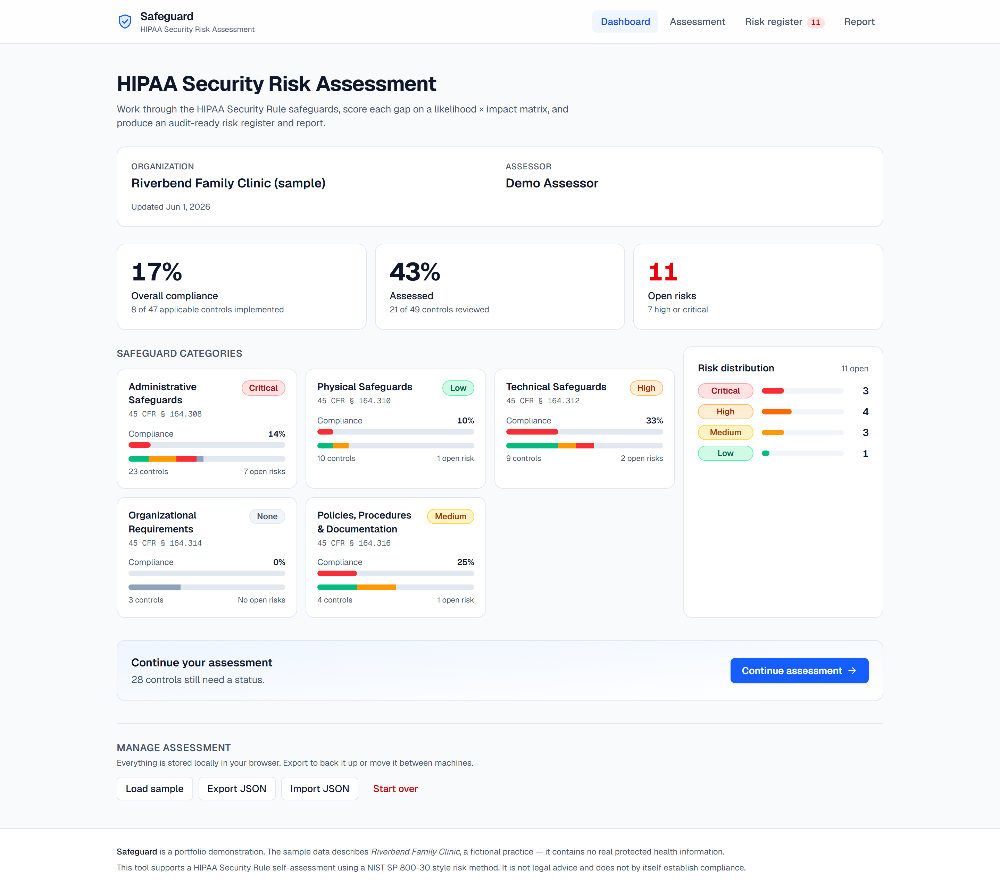
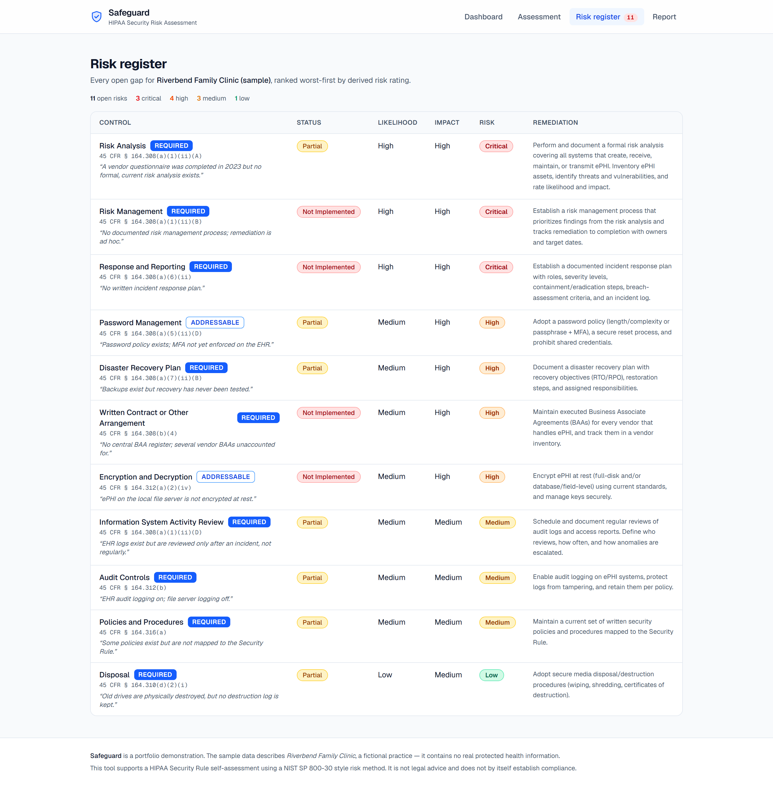
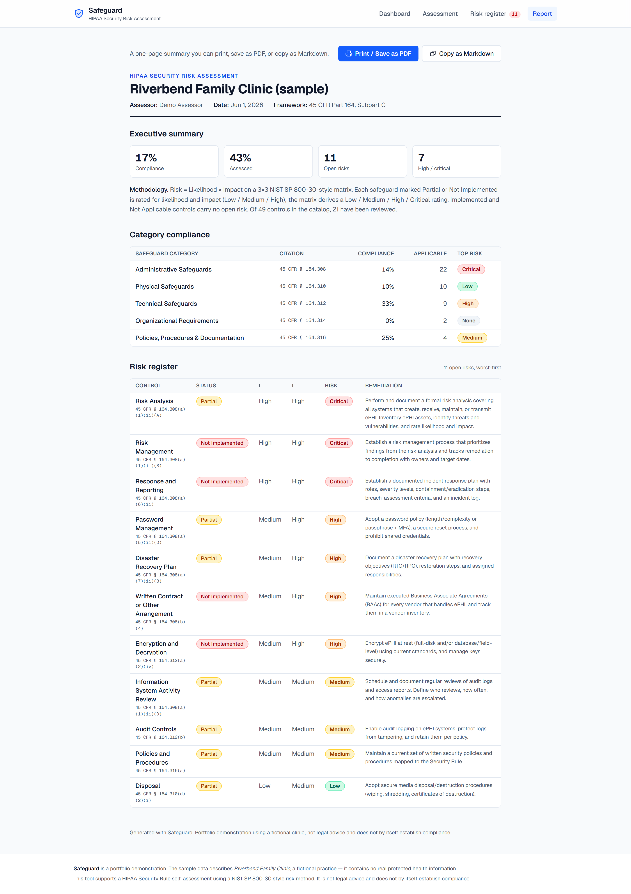

# Safeguard

**Run a HIPAA Security Risk Assessment in your browser — and walk away with the risk register and report an auditor actually asks for.**

Every healthcare organization that touches electronic protected health information (ePHI) is required to perform a security risk analysis (45 CFR Part 164, Subpart C). Safeguard walks you through that exercise control by control, scores your gaps with a defensible methodology, and hands you the deliverables: a compliance dashboard, a ranked risk register, and a printable report.

**[→ Try the live demo](https://safeguard-sra.vercel.app)** — it opens pre-filled with a sample clinic, so there's nothing to set up. Click around.

---

## Who it's for

If you do healthcare GRC — security risk analyst, compliance officer, vCISO, or anyone who has stared at the HHS/ONC "SRA Tool" and wished it were less painful — this is the same exercise in a clean web app. It turns the HIPAA Security Rule from a PDF you skim into something you can actually work through and produce evidence from.

It's also a portfolio project. More on that below.

## What it does

1. **Work through the Security Rule, organized the way the regulation is.** Five safeguard groups — Administrative (§164.308), Physical (§164.310), Technical (§164.312), Organizational (§164.314), and Policies, Procedures & Documentation (§164.316) — each with its standards and implementation specifications.
2. **Mark every specification as Required or Addressable** — the real HIPAA distinction, not a checkbox flattened into "do it or don't." Each control carries its exact CFR citation and a plain-language description of what it asks for.
3. **Set an implementation status** for each control: Implemented, Partial, Not Implemented, or Not Applicable, with room for notes.
4. **Rate the gaps.** Anything not fully implemented gets a Likelihood × Impact rating (Low / Medium / High). A 3×3 matrix in the NIST SP 800-30 style derives a Low / Medium / High / Critical risk rating — so the output is reproducible, not a number you made up.
5. **See where you stand** on a dashboard: overall compliance, how much you've assessed, open-risk counts, per-category compliance, and a risk distribution.
6. **Export the deliverables** an assessment is supposed to produce — a ranked risk register and a one-page report.

## Key features

- **Compliance dashboard** — overall compliance percentage, assessment progress, open-risk counts, and per-safeguard breakdowns at a glance.
- **Required vs. Addressable, kept honest** — Safeguard preserves the distinction the rule actually draws, so an Addressable control you've reasonably decided against reads differently from a Required one you've skipped.
- **Risk register** — every open gap, ranked worst-first, with its control name, CFR citation, status, likelihood, impact, derived rating, and a remediation recommendation. This is the artifact, not a summary of it.
- **Report export** — a clean one-page report you can **print or save as PDF** (dedicated print stylesheet) or **copy as Markdown** to drop into a ticket, wiki, or findings doc.
- **Sample clinic, ready to explore** — a fictional "Riverbend Family Clinic" ships seeded with a realistic mid-assessment posture (solid basics, a few serious gaps), so the app tells a story the moment it loads.
- **Local and private by design** — no login, no database, no server. Your assessment lives in your browser. Export to JSON to back it up or move it between machines; import to pick up where you left off. Nothing you enter leaves your device.

## Screenshots

| Dashboard | Assessment |
| --- | --- |
|  |  |

| Risk register | Report |
| --- | --- |
|  |  |

## Why I built this

I wanted one project that proves two things at once: that I understand healthcare compliance well enough to operationalize it, and that I can ship the software to back it up.

The HIPAA Security Rule risk analysis is a good test of both. Doing it right means knowing the safeguard structure, respecting the Required-vs-Addressable distinction, citing controls correctly, and applying a risk methodology you can defend in front of an auditor. Building it right means turning a dense regulation into a tool someone would actually choose over the government's desktop app. Safeguard is my answer to both.

## Tech notes

Next.js (App Router) and React with TypeScript and Tailwind. Everything runs client-side — the control catalog is typed static data, the scoring lives in pure functions, and state persists to `localStorage`. There's no backend to stand up, which keeps deployment trivial and means no real data is ever stored anywhere.

## Run it locally

```bash
git clone https://github.com/TanmayKallakuri/safeguard-sra.git
cd safeguard-sra
npm install
npm run dev
```

Then open [http://localhost:3000](http://localhost:3000). It loads with the sample clinic already populated.

To build for production:

```bash
npm run build
npm run start
```

## Disclaimer

Safeguard is an educational portfolio demonstration. It uses entirely fictional sample data ("Riverbend Family Clinic" is invented and contains no real protected health information). It is **not legal or compliance advice**, and completing an assessment in it does not by itself establish HIPAA compliance. It is **not affiliated with or endorsed by HHS, ONC, or any government agency**, and is not the official HHS/ONC SRA Tool. For an actual risk analysis, work with qualified compliance counsel.
